# Rebuildings Project — API Documentation

> **Base URL**: `http://localhost:5000/api/v1`  
> **Auth**: Bearer JWT token in `Authorization` header  
> **Content-Type**: `application/json` (unless uploading files)

---

## Table of Contents

1. [Entity Relationship Diagram](#entity-relationship-diagram)
2. [Request Status State Machine](#request-status-state-machine)
3. [Authentication Flow](#authentication-flow)
4. [Role & Permission Overview](#role--permission-overview)
5. [Auth Endpoints](#auth-endpoints)
   - [POST /auth/register](#post-authregister)
   - [POST /auth/login](#post-authlogin)
6. [User Endpoints](#user-endpoints)
   - [GET /services](#get-services)
7. [Request Endpoints (USER)](#request-endpoints-user)
   - [POST /requests](#post-requests)
   - [GET /requests/my](#get-requestsmy)
   - [GET /requests/:id](#get-requestsid)
   - [PATCH /requests/:id](#patch-requestsid)
   - [DELETE /requests/:id](#delete-requestsid)
8. [Reviewer Endpoints](#reviewer-endpoints)
   - [GET /reviewer/requests](#get-reviewerrequests)
   - [PATCH /reviewer/requests/:id/status](#patch-reviewerrequestsidstatus)
   - [POST /reviewer/requests/:id/note](#post-reviewerrequestsidnote)
9. [Admin Endpoints](#admin-endpoints)
   - [User Management](#admin-user-management)
   - [Service Management](#admin-service-management)
   - [Service Field Management](#admin-service-field-management)
   - [Request Management (Admin)](#admin-request-management)
   - [GET /admin/statistics](#get-adminstatistics)
10. [Health Check](#health-check)
11. [Error Responses](#error-responses)
12. [Pagination](#pagination)

---

## Entity Relationship Diagram

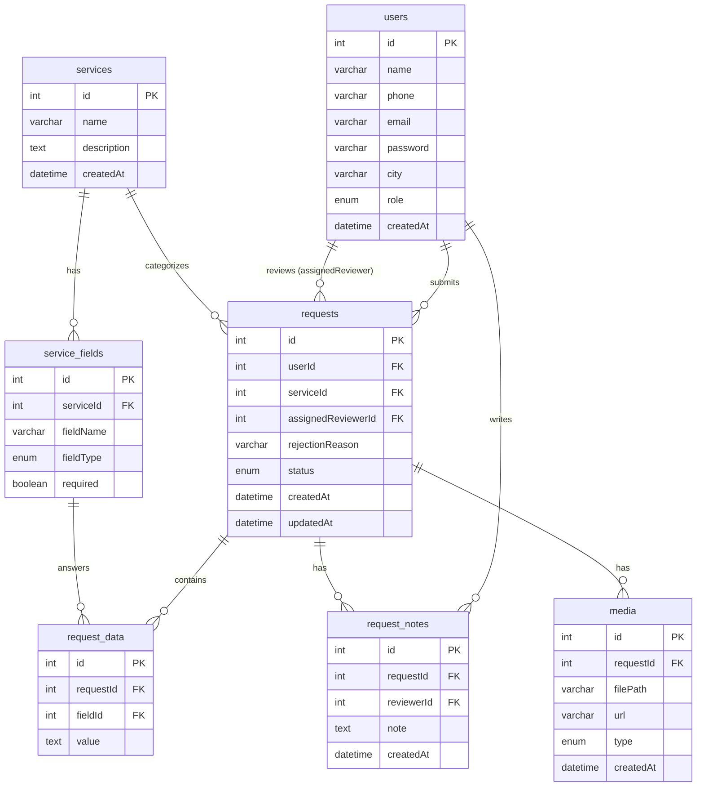
```mermaid
erDiagram
    users {
        int id PK
        varchar name
        varchar phone
        varchar email
        varchar password
        varchar city
        enum role
        datetime createdAt
    }

    services {
        int id PK
        varchar name
        text description
        datetime createdAt
    }

    service_fields {
        int id PK
        int serviceId FK
        varchar fieldName
        enum fieldType
        boolean required
    }

    requests {
        int id PK
        int userId FK
        int serviceId FK
        int assignedReviewerId FK
        varchar rejectionReason
        enum status
        datetime createdAt
        datetime updatedAt
    }

    request_data {
        int id PK
        int requestId FK
        int fieldId FK
        text value
    }

    request_notes {
        int id PK
        int requestId FK
        int reviewerId FK
        text note
        datetime createdAt
    }

    media {
        int id PK
        int requestId FK
        varchar filePath
        varchar url
        enum type
        datetime createdAt
    }

    users ||--o{ requests : "submits"
    users ||--o{ requests : "reviews (assignedReviewer)"
    users ||--o{ request_notes : "writes"
    services ||--o{ service_fields : "has"
    services ||--o{ requests : "categorizes"
    requests ||--o{ request_data : "contains"
    requests ||--o{ request_notes : "has"
    requests ||--o{ media : "has"
    service_fields ||--o{ request_data : "answers"
```

---

## Request Status State Machine

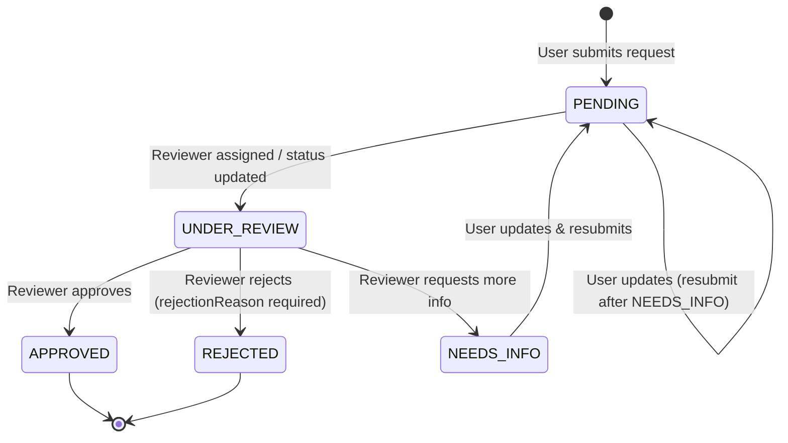
```mermaid
stateDiagram-v2
    [*] --> PENDING : User submits request

    PENDING --> UNDER_REVIEW : Reviewer assigned / status updated
    PENDING --> PENDING : User updates (resubmit after NEEDS_INFO)

    UNDER_REVIEW --> APPROVED : Reviewer approves
    UNDER_REVIEW --> REJECTED : Reviewer rejects (rejectionReason required)
    UNDER_REVIEW --> NEEDS_INFO : Reviewer requests more info

    NEEDS_INFO --> PENDING : User updates & resubmits

    APPROVED --> [*]
    REJECTED --> [*]
```

**Transition Rules:**

| From | To | Who | Extra requirement |
|---|---|---|---|
| _(new)_ | `PENDING` | USER | Create request |
| `PENDING` | `UNDER_REVIEW` | REVIEWER/ADMIN | — |
| `UNDER_REVIEW` | `APPROVED` | REVIEWER/ADMIN | — |
| `UNDER_REVIEW` | `REJECTED` | REVIEWER/ADMIN | `rejectionReason` required |
| `UNDER_REVIEW` | `NEEDS_INFO` | REVIEWER/ADMIN | — |
| `NEEDS_INFO` | `PENDING` | USER | PATCH /requests/:id (resets status back to PENDING) |

---

## Authentication Flow

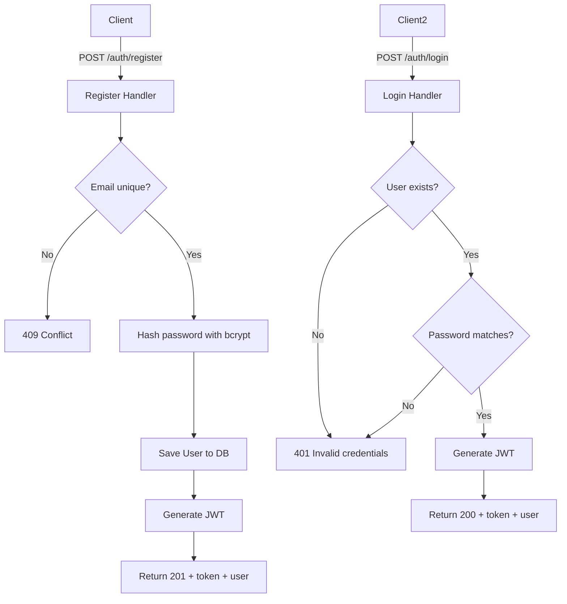
```mermaid
flowchart TD
    Client -->|POST /auth/register| A[Register Handler]
    A --> B{Email unique?}
    B -->|No| C[409 Conflict]
    B -->|Yes| D[Hash password with bcrypt]
    D --> E[Save User to DB]
    E --> F[Generate JWT]
    F --> G[Return 201 + token + user]

    Client2 -->|POST /auth/login| H[Login Handler]
    H --> I{User exists?}
    I -->|No| J[401 Invalid credentials]
    I -->|Yes| K{Password matches?}
    K -->|No| J
    K -->|Yes| L[Generate JWT]
    L --> M[Return 200 + token + user]
```

---

## Role & Permission Overview

```mermaid
flowchart LR
    subgraph Roles
        U[USER]
        R[REVIEWER]
        A[ADMIN]
    end

    subgraph Endpoints
        Auth[/auth/register, /auth/login]
        Services[GET /services]
        Requests[/requests/*]
        Reviewer[/reviewer/*]
        Admin[/admin/*]
        Health[GET /health]
    end

    U --> Auth
    U --> Services
    U --> Requests
    R --> Reviewer
    A --> Reviewer
    A --> Admin
    Health -.->|public| Everyone
```

| Role | Auth | GET /services | /requests | /reviewer | /admin |
|---|---|---|---|---|---|
| **Public** | ✅ | ❌ | ❌ | ❌ | ❌ |
| **USER** | ✅ | ✅ | ✅ | ❌ | ❌ |
| **REVIEWER** | ✅ | — | ❌ | ✅ | ❌ |
| **ADMIN** | ✅ | — | ❌ | ✅ | ✅ |

---

## Auth Endpoints

### POST /auth/register

Register a new user account.

**Auth**: None (public)

**Request Body:**

| Field | Type | Required | Rules |
|---|---|---|---|
| `name` | string | ✅ | 2–150 chars |
| `phone` | string | ✅ | non-empty |
| `email` | string | ✅ | valid email |
| `password` | string | ✅ | 8–50 chars |
| `city` | string | ✅ | non-empty |
| `role` | `USER` \| `REVIEWER` \| `ADMIN` | ❌ | defaults to `USER` |

**Example Request:**
```json
{
  "name": "Ahmad Ali",
  "phone": "0912345678",
  "email": "ahmad@example.com",
  "password": "secret123",
  "city": "Damascus"
}
```

**Response 201:**
```json
{
  "success": true,
  "data": {
    "token": "eyJhbGciOiJIUzI1NiIsInR5cCI6IkpXVCJ9...",
    "user": {
      "id": 1,
      "name": "Ahmad Ali",
      "email": "ahmad@example.com",
      "role": "USER",
      "city": "Damascus"
    }
  }
}
```

**Error Responses:**

| Status | Reason |
|---|---|
| 400 | Validation failed (missing/invalid fields) |
| 409 | Email already registered |

**Flow:**

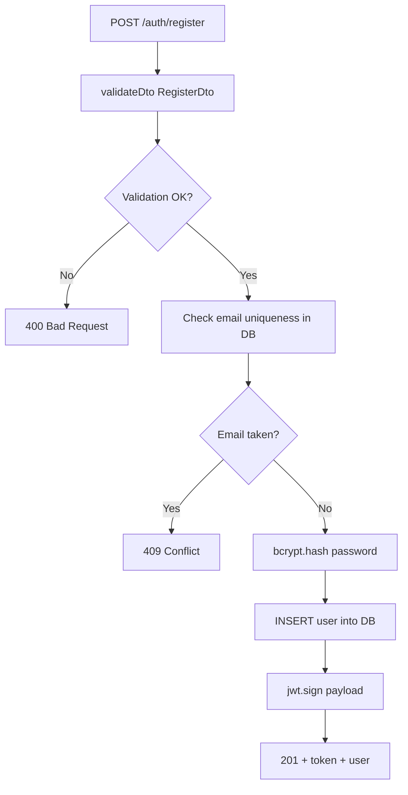
```mermaid
flowchart TD
    A[POST /auth/register] --> B[validateDto RegisterDto]
    B --> C{Validation OK?}
    C -->|No| D[400 Bad Request]
    C -->|Yes| E[Check email uniqueness in DB]
    E --> F{Email taken?}
    F -->|Yes| G[409 Conflict]
    F -->|No| H[bcrypt.hash password]
    H --> I[INSERT user into DB]
    I --> J[jwt.sign payload]
    J --> K[201 + token + user]
```

---

### POST /auth/login

Authenticate and receive a JWT token.

**Auth**: None (public)

**Request Body:**

| Field | Type | Required | Rules |
|---|---|---|---|
| `email` | string | ✅ | valid email |
| `password` | string | ✅ | non-empty |

**Example Request:**
```json
{
  "email": "ahmad@example.com",
  "password": "secret123"
}
```

**Response 200:**
```json
{
  "success": true,
  "data": {
    "token": "eyJhbGciOiJIUzI1NiIsInR5cCI6IkpXVCJ9...",
    "user": {
      "id": 1,
      "name": "Ahmad Ali",
      "email": "ahmad@example.com",
      "role": "USER"
    }
  }
}
```

**Error Responses:**

| Status | Reason |
|---|---|
| 400 | Validation failed |
| 401 | Invalid email or password |

**Flow:**

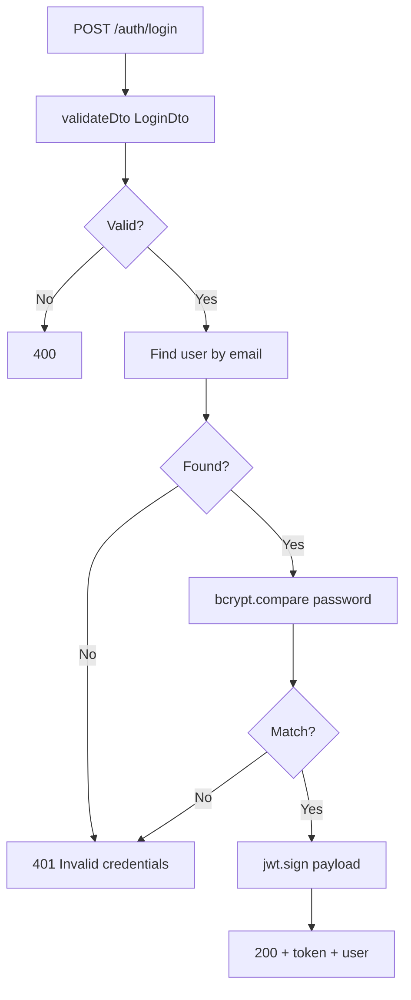
```mermaid
flowchart TD
    A[POST /auth/login] --> B[validateDto LoginDto]
    B --> C{Valid?}
    C -->|No| D[400]
    C -->|Yes| E[Find user by email]
    E --> F{Found?}
    F -->|No| G[401 Invalid credentials]
    F -->|Yes| H[bcrypt.compare password]
    H --> I{Match?}
    I -->|No| G
    I -->|Yes| J[jwt.sign payload]
    J --> K[200 + token + user]
```

---

## User Endpoints

### GET /services

List all available services with their fields.

**Auth**: Bearer token — role `USER`

**Query Params**: None

**Response 200:**
```json
{
  "success": true,
  "data": [
    {
      "id": 1,
      "name": "Reconstruction",
      "description": "Rebuild damaged homes",
      "fields": [
        { "id": 1, "fieldName": "damageDescription", "fieldType": "text", "required": true },
        { "id": 2, "fieldName": "photos", "fieldType": "file", "required": false }
      ]
    }
  ]
}
```

**Error Responses:**

| Status | Reason |
|---|---|
| 401 | Missing or invalid token |
| 403 | Role is not USER |

**Flow:**

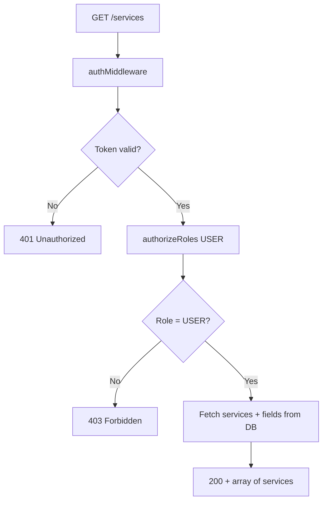
```mermaid
flowchart TD
    A[GET /services] --> B[authMiddleware]
    B --> C{Token valid?}
    C -->|No| D[401 Unauthorized]
    C -->|Yes| E[authorizeRoles USER]
    E --> F{Role = USER?}
    F -->|No| G[403 Forbidden]
    F -->|Yes| H[Fetch services + fields from DB]
    H --> I[200 + array of services]
```

---

## Request Endpoints (USER)

All endpoints require `Authorization: Bearer <token>` with role `USER`.

---

### POST /requests

Submit a new service request.

**Auth**: Bearer — role `USER`

**Request Body:**

| Field | Type | Required | Rules |
|---|---|---|---|
| `serviceId` | number | ✅ | positive integer |
| `data` | `RequestFieldValue[]` | ✅ | at least one entry |
| `data[].fieldId` | number | ✅ | positive integer |
| `data[].value` | string | ✅ | non-empty |
| `media` | `RequestMedia[]` | ❌ | optional attachments |
| `media[].filePath` | string | ✅ | non-empty |
| `media[].url` | string | ❌ | valid URL if provided |
| `media[].type` | `image` \| `pdf` | ✅ | — |

**Example Request:**
```json
{
  "serviceId": 1,
  "data": [
    { "fieldId": 1, "value": "House destroyed in earthquake" },
    { "fieldId": 2, "value": "3 rooms damaged" }
  ],
  "media": [
    { "filePath": "uploads/photo1.jpg", "type": "image" }
  ]
}
```

**Response 201:**
```json
{
  "success": true,
  "data": {
    "id": 42,
    "userId": 1,
    "serviceId": 1,
    "status": "PENDING",
    "createdAt": "2024-01-15T10:30:00.000Z",
    "data": [...],
    "media": [...]
  }
}
```

**Error Responses:**

| Status | Reason |
|---|---|
| 400 | Validation failed / unknown fieldIds |
| 401 | Not authenticated |
| 403 | Role is not USER |
| 404 | Service not found |

**Flow:**

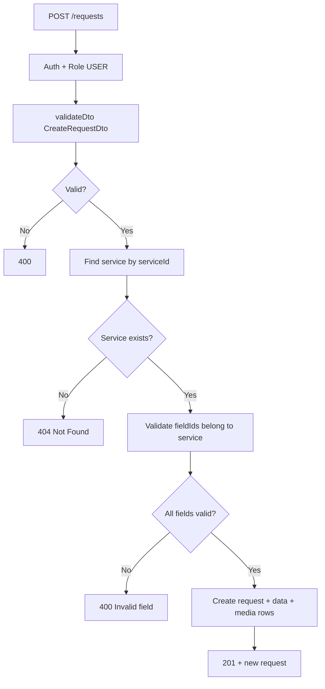
```mermaid
flowchart TD
    A[POST /requests] --> B[Auth + Role USER]
    B --> C[validateDto CreateRequestDto]
    C --> D{Valid?}
    D -->|No| E[400]
    D -->|Yes| F[Find service by serviceId]
    F --> G{Service exists?}
    G -->|No| H[404 Not Found]
    G -->|Yes| I[Validate fieldIds belong to service]
    I --> J{All fields valid?}
    J -->|No| K[400 Invalid field]
    J -->|Yes| L[Create request + data + media rows]
    L --> M[201 + new request]
```

---

### GET /requests/my

List the authenticated user's own requests with pagination and filtering.

**Auth**: Bearer — role `USER`

**Query Parameters:**

| Param | Type | Required | Description |
|---|---|---|---|
| `page` | number | ❌ | Page number (default: 1) |
| `limit` | number | ❌ | Items per page (default: 10) |
| `status` | RequestStatus | ❌ | Filter by status |
| `serviceId` | number | ❌ | Filter by service |

**Response 200:**
```json
{
  "success": true,
  "data": [
    {
      "id": 42,
      "serviceId": 1,
      "status": "PENDING",
      "createdAt": "2024-01-15T10:30:00.000Z",
      "updatedAt": "2024-01-15T10:30:00.000Z",
      "service": { "id": 1, "name": "Reconstruction" },
      "data": [...],
      "notes": [...],
      "media": [...]
    }
  ],
  "meta": {
    "page": 1,
    "limit": 10,
    "total": 5,
    "totalPages": 1
  }
}
```

**Flow:**

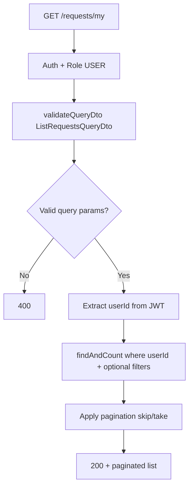
```mermaid
flowchart TD
    A[GET /requests/my] --> B[Auth + Role USER]
    B --> C[validateQueryDto ListRequestsQueryDto]
    C --> D{Valid query params?}
    D -->|No| E[400]
    D -->|Yes| F[Extract userId from JWT]
    F --> G[findAndCount where userId + optional filters]
    G --> H[Apply pagination skip/take]
    H --> I[200 + paginated list]
```

---

### GET /requests/:id

Get a single request belonging to the authenticated user.

**Auth**: Bearer — role `USER`

**Path Params:**

| Param | Type | Description |
|---|---|---|
| `id` | number | Request ID |

**Response 200:**
```json
{
  "success": true,
  "data": {
    "id": 42,
    "userId": 1,
    "serviceId": 1,
    "status": "PENDING",
    "rejectionReason": null,
    "assignedReviewerId": null,
    "createdAt": "2024-01-15T10:30:00.000Z",
    "updatedAt": "2024-01-15T10:30:00.000Z",
    "service": { "id": 1, "name": "Reconstruction" },
    "data": [
      { "fieldId": 1, "value": "House destroyed" }
    ],
    "notes": [],
    "media": []
  }
}
```

**Error Responses:**

| Status | Reason |
|---|---|
| 401 | Not authenticated |
| 403 | Role is not USER |
| 404 | Request not found or not owned by user |

**Flow:**

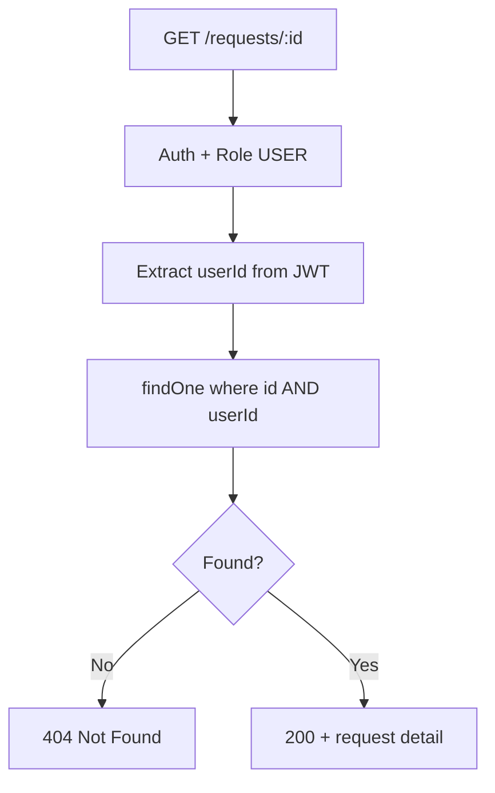
```mermaid
flowchart TD
    A[GET /requests/:id] --> B[Auth + Role USER]
    B --> C[Extract userId from JWT]
    C --> D[findOne where id AND userId]
    D --> E{Found?}
    E -->|No| F[404 Not Found]
    E -->|Yes| G[200 + request detail]
```

---

### PATCH /requests/:id

Update a request (only allowed when status is `NEEDS_INFO`). Resets status back to `PENDING` upon successful update.

**Auth**: Bearer — role `USER`

**Path Params:**

| Param | Type | Description |
|---|---|---|
| `id` | number | Request ID |

**Request Body:**

| Field | Type | Required | Rules |
|---|---|---|---|
| `data` | `RequestFieldValue[]` | ❌ | Updated field values |
| `data[].fieldId` | number | ✅ | positive integer |
| `data[].value` | string | ✅ | non-empty |

**Example Request:**
```json
{
  "data": [
    { "fieldId": 1, "value": "Updated description with more details" }
  ]
}
```

**Response 200:**
```json
{
  "success": true,
  "data": {
    "id": 42,
    "status": "PENDING",
    "updatedAt": "2024-01-16T08:00:00.000Z"
  }
}
```

**Error Responses:**

| Status | Reason |
|---|---|
| 400 | Validation failed |
| 401 | Not authenticated |
| 403 | Role is not USER |
| 404 | Request not found or not owned by user |
| 409 | Request is not in `NEEDS_INFO` status |

**Flow:**

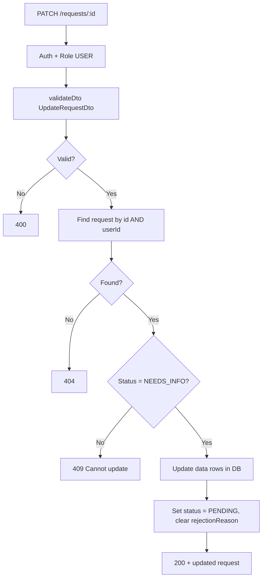
```mermaid
flowchart TD
    A[PATCH /requests/:id] --> B[Auth + Role USER]
    B --> C[validateDto UpdateRequestDto]
    C --> D{Valid?}
    D -->|No| E[400]
    D -->|Yes| F[Find request by id AND userId]
    F --> G{Found?}
    G -->|No| H[404]
    G -->|Yes| I{Status = NEEDS_INFO?}
    I -->|No| J[409 Cannot update]
    I -->|Yes| K[Update data rows in DB]
    K --> L[Set status = PENDING, clear rejectionReason]
    L --> M[200 + updated request]
```

---

### DELETE /requests/:id

Delete a request (only allowed when status is `PENDING`).

**Auth**: Bearer — role `USER`

**Path Params:**

| Param | Type | Description |
|---|---|---|
| `id` | number | Request ID |

**Response 200:**
```json
{
  "success": true,
  "message": "Request deleted successfully"
}
```

**Error Responses:**

| Status | Reason |
|---|---|
| 401 | Not authenticated |
| 403 | Role is not USER |
| 404 | Request not found or not owned by user |
| 409 | Request cannot be deleted (not PENDING) |

**Flow:**

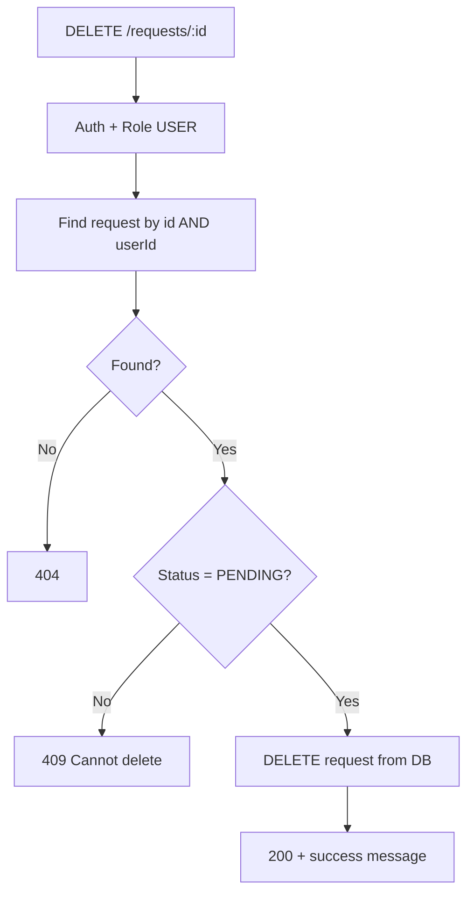
```mermaid
flowchart TD
    A[DELETE /requests/:id] --> B[Auth + Role USER]
    B --> C[Find request by id AND userId]
    C --> D{Found?}
    D -->|No| E[404]
    D -->|Yes| F{Status = PENDING?}
    F -->|No| G[409 Cannot delete]
    F -->|Yes| H[DELETE request from DB]
    H --> I[200 + success message]
```

---

## Reviewer Endpoints

All endpoints require `Authorization: Bearer <token>` with role `REVIEWER` or `ADMIN`.

---

### GET /reviewer/requests

List requests for review. Reviewers see only their assigned requests by default; pass `mode=all` to see all.

**Auth**: Bearer — role `REVIEWER` or `ADMIN`

**Query Parameters:**

| Param | Type | Required | Description |
|---|---|---|---|
| `page` | number | ❌ | Page number (default: 1) |
| `limit` | number | ❌ | Items per page (default: 10) |
| `status` | RequestStatus | ❌ | Filter by status |
| `serviceId` | number | ❌ | Filter by service |
| `city` | string | ❌ | Filter by user city |
| `search` | string | ❌ | Search by user name/email |
| `mode` | `assigned` \| `all` | ❌ | `assigned` (default) or `all` |

**Response 200:**
```json
{
  "success": true,
  "data": [
    {
      "id": 42,
      "status": "PENDING",
      "createdAt": "2024-01-15T10:30:00.000Z",
      "user": { "id": 1, "name": "Ahmad Ali", "city": "Damascus" },
      "service": { "id": 1, "name": "Reconstruction" },
      "data": [...],
      "notes": [...]
    }
  ],
  "meta": { "page": 1, "limit": 10, "total": 20, "totalPages": 2 }
}
```

**Flow:**

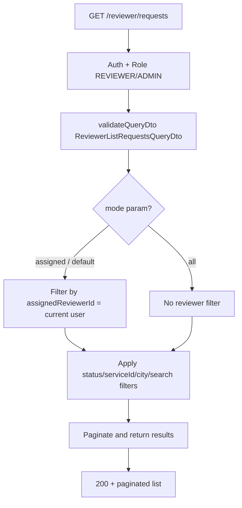
```mermaid
flowchart TD
    A[GET /reviewer/requests] --> B[Auth + Role REVIEWER/ADMIN]
    B --> C[validateQueryDto ReviewerListRequestsQueryDto]
    C --> D{mode param?}
    D -->|assigned / default| E[Filter by assignedReviewerId = current user]
    D -->|all| F[No reviewer filter]
    E --> G[Apply status/serviceId/city/search filters]
    F --> G
    G --> H[Paginate and return results]
    H --> I[200 + paginated list]
```

---

### PATCH /reviewer/requests/:id/status

Update the status of a request.

**Auth**: Bearer — role `REVIEWER` or `ADMIN`

**Path Params:**

| Param | Type | Description |
|---|---|---|
| `id` | number | Request ID |

**Request Body:**

| Field | Type | Required | Rules |
|---|---|---|---|
| `status` | RequestStatus | ✅ | One of the enum values |
| `rejectionReason` | string | ❌ | Required when status is `REJECTED`, max 1000 chars |

**Example Request:**
```json
{
  "status": "REJECTED",
  "rejectionReason": "Insufficient documentation provided"
}
```

**Response 200:**
```json
{
  "success": true,
  "data": {
    "id": 42,
    "status": "REJECTED",
    "rejectionReason": "Insufficient documentation provided",
    "updatedAt": "2024-01-16T09:00:00.000Z"
  }
}
```

**Error Responses:**

| Status | Reason |
|---|---|
| 400 | Validation failed / `rejectionReason` missing when REJECTED |
| 401 | Not authenticated |
| 403 | Role not REVIEWER or ADMIN |
| 404 | Request not found |

**Flow:**

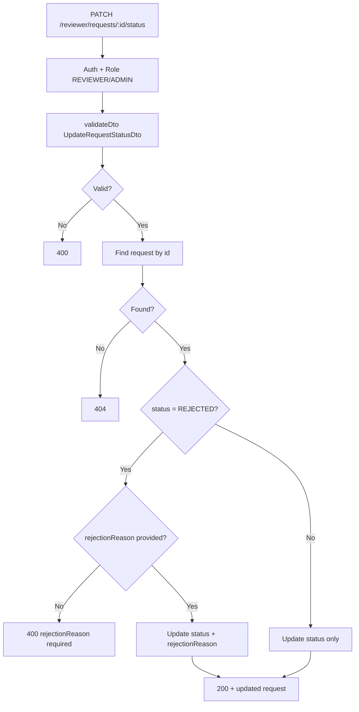
```mermaid
flowchart TD
    A[PATCH /reviewer/requests/:id/status] --> B[Auth + Role REVIEWER/ADMIN]
    B --> C[validateDto UpdateRequestStatusDto]
    C --> D{Valid?}
    D -->|No| E[400]
    D -->|Yes| F[Find request by id]
    F --> G{Found?}
    G -->|No| H[404]
    G -->|Yes| I{status = REJECTED?}
    I -->|Yes| J{rejectionReason provided?}
    J -->|No| K[400 rejectionReason required]
    J -->|Yes| L[Update status + rejectionReason]
    I -->|No| M[Update status only]
    L --> N[200 + updated request]
    M --> N
```

---

### POST /reviewer/requests/:id/note

Add a reviewer note to a request.

**Auth**: Bearer — role `REVIEWER` or `ADMIN`

**Path Params:**

| Param | Type | Description |
|---|---|---|
| `id` | number | Request ID |

**Request Body:**

| Field | Type | Required | Rules |
|---|---|---|---|
| `note` | string | ✅ | non-empty |

**Example Request:**
```json
{
  "note": "Awaiting property ownership documents from applicant"
}
```

**Response 201:**
```json
{
  "success": true,
  "data": {
    "id": 7,
    "requestId": 42,
    "reviewerId": 3,
    "note": "Awaiting property ownership documents from applicant",
    "createdAt": "2024-01-16T09:15:00.000Z"
  }
}
```

**Error Responses:**

| Status | Reason |
|---|---|
| 400 | Validation failed |
| 401 | Not authenticated |
| 403 | Role not REVIEWER or ADMIN |
| 404 | Request not found |

**Flow:**

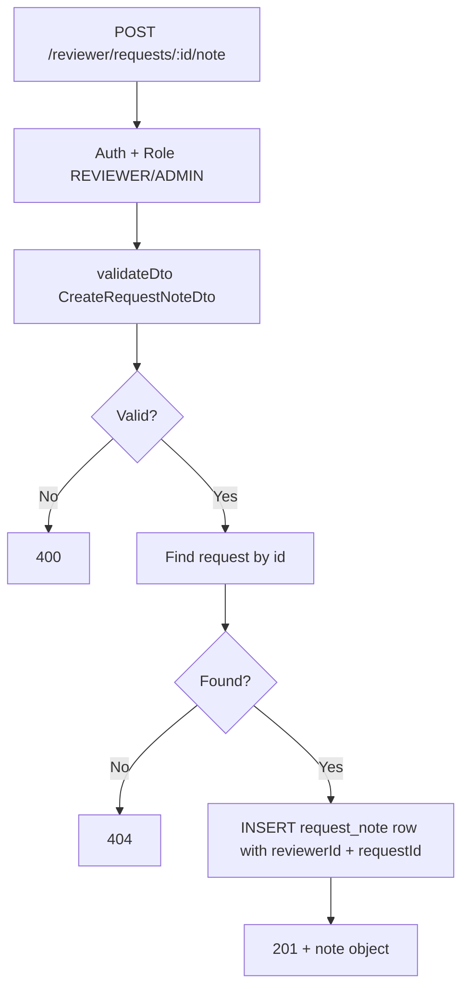
```mermaid
flowchart TD
    A[POST /reviewer/requests/:id/note] --> B[Auth + Role REVIEWER/ADMIN]
    B --> C[validateDto CreateRequestNoteDto]
    C --> D{Valid?}
    D -->|No| E[400]
    D -->|Yes| F[Find request by id]
    F --> G{Found?}
    G -->|No| H[404]
    G -->|Yes| I[INSERT request_note row with reviewerId + requestId]
    I --> J[201 + note object]
```

---

## Admin Endpoints

All endpoints require `Authorization: Bearer <token>` with role `ADMIN`.

---

### Admin User Management

#### GET /admin/users

List all users with pagination and optional filtering.

**Auth**: Bearer — role `ADMIN`

**Query Parameters:**

| Param | Type | Required | Description |
|---|---|---|---|
| `page` | number | ❌ | Page (default: 1) |
| `limit` | number | ❌ | Per page (default: 10) |
| `search` | string | ❌ | Search by name or email |
| `role` | UserRole | ❌ | Filter by role |

**Response 200:**
```json
{
  "success": true,
  "data": [
    {
      "id": 1,
      "name": "Ahmad Ali",
      "email": "ahmad@example.com",
      "phone": "0912345678",
      "city": "Damascus",
      "role": "USER",
      "createdAt": "2024-01-10T00:00:00.000Z"
    }
  ],
  "meta": { "page": 1, "limit": 10, "total": 50, "totalPages": 5 }
}
```

---

#### POST /admin/users

Create a new user with any role.

**Auth**: Bearer — role `ADMIN`

**Request Body:**

| Field | Type | Required | Rules |
|---|---|---|---|
| `name` | string | ✅ | 2–150 chars |
| `email` | string | ✅ | valid email |
| `password` | string | ✅ | 8–50 chars |
| `phone` | string | ✅ | non-empty |
| `city` | string | ✅ | non-empty |
| `role` | UserRole | ✅ | `USER` \| `REVIEWER` \| `ADMIN` |

**Response 201:**
```json
{
  "success": true,
  "data": { "id": 10, "name": "...", "role": "REVIEWER", ... }
}
```

**Error Responses:**

| Status | Reason |
|---|---|
| 400 | Validation failed |
| 409 | Email already exists |

---

#### PATCH /admin/users/:id

Update user information.

**Auth**: Bearer — role `ADMIN`

**Path Params:** `id` (number)

**Request Body** (all optional):

| Field | Type | Rules |
|---|---|---|
| `name` | string | 2–150 chars |
| `email` | string | valid email |
| `phone` | string | non-empty |
| `city` | string | non-empty |
| `role` | UserRole | — |

**Response 200:**
```json
{ "success": true, "data": { "id": 10, "name": "Updated Name", ... } }
```

**Error Responses:** 400 (validation), 404 (user not found), 409 (email taken)

---

#### DELETE /admin/users/:id

Delete a user by ID.

**Auth**: Bearer — role `ADMIN`

**Response 200:**
```json
{ "success": true, "message": "User deleted successfully" }
```

**Error Responses:** 404 (user not found)

**Flow for User CRUD:**

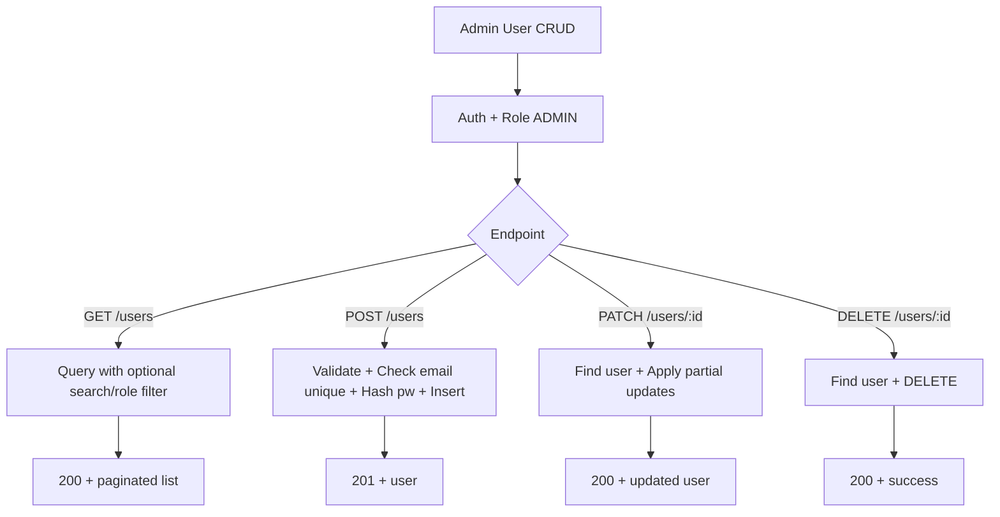
```mermaid
flowchart TD
    A[Admin User CRUD] --> B[Auth + Role ADMIN]
    B --> C{Endpoint}
    C -->|GET /users| D[Query with optional search/role filter]
    C -->|POST /users| E[Validate + Check email unique + Hash pw + Insert]
    C -->|PATCH /users/:id| F[Find user + Apply partial updates]
    C -->|DELETE /users/:id| G[Find user + DELETE]
    D --> H[200 + paginated list]
    E --> I[201 + user]
    F --> J[200 + updated user]
    G --> K[200 + success]
```

---

### Admin Service Management

#### GET /admin/services

List all services with their fields.

**Auth**: Bearer — role `ADMIN`

**Response 200:**
```json
{
  "success": true,
  "data": [
    {
      "id": 1,
      "name": "Reconstruction",
      "description": "...",
      "fields": [
        { "id": 1, "fieldName": "damage", "fieldType": "text", "required": true }
      ]
    }
  ]
}
```

---

#### POST /admin/services

Create a new service.

**Auth**: Bearer — role `ADMIN`

**Request Body:**

| Field | Type | Required |
|---|---|---|
| `name` | string | ✅ |
| `description` | string | ❌ |

**Response 201:** `{ "success": true, "data": { "id": 4, "name": "..." } }`

---

#### PATCH /admin/services/:id

Update a service name or description.

**Auth**: Bearer — role `ADMIN`

**Request Body** (all optional): `name`, `description`

**Response 200:** Updated service object.

---

#### DELETE /admin/services/:id

Delete a service (will fail if requests exist for this service due to `RESTRICT` FK).

**Auth**: Bearer — role `ADMIN`

**Response 200:** `{ "success": true, "message": "Service deleted" }`

**Error Responses:** 404 (not found), 409 (requests reference this service)

**Flow for Service CRUD:**

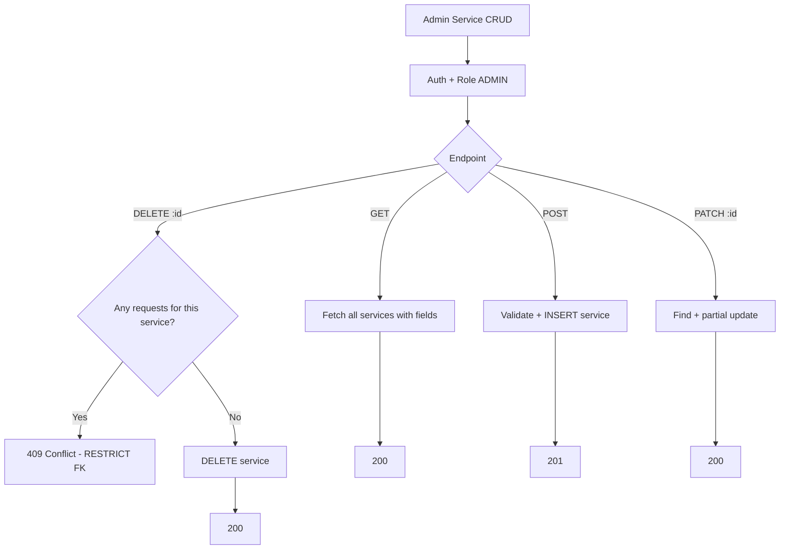
```mermaid
flowchart TD
    A[Admin Service CRUD] --> B[Auth + Role ADMIN]
    B --> C{Endpoint}
    C -->|GET| D[Fetch all services with fields]
    C -->|POST| E[Validate + INSERT service]
    C -->|PATCH :id| F[Find + partial update]
    C -->|DELETE :id| G{Any requests for this service?}
    G -->|Yes| H[409 Conflict - RESTRICT FK]
    G -->|No| I[DELETE service]
    D --> J[200]
    E --> K[201]
    F --> L[200]
    I --> M[200]
```

---

### Admin Service Field Management

Service fields define the schema/form for each service.

#### GET /admin/service-fields

List service fields, optionally filtered by `serviceId`.

**Auth**: Bearer — role `ADMIN`

**Query Parameters:**

| Param | Type | Required | Description |
|---|---|---|---|
| `serviceId` | number | ❌ | Filter fields by service |

**Response 200:**
```json
{
  "success": true,
  "data": [
    { "id": 1, "serviceId": 1, "fieldName": "damage", "fieldType": "text", "required": true }
  ]
}
```

---

#### POST /admin/service-fields

Add a field to a service.

**Auth**: Bearer — role `ADMIN`

**Request Body:**

| Field | Type | Required | Rules |
|---|---|---|---|
| `serviceId` | number | ✅ | positive integer |
| `fieldName` | string | ✅ | non-empty |
| `fieldType` | `text` \| `number` \| `file` \| `date` | ✅ | — |
| `required` | boolean | ✅ | — |

**Response 201:**
```json
{ "success": true, "data": { "id": 5, "serviceId": 1, "fieldName": "photos", "fieldType": "file", "required": false } }
```

---

#### PATCH /admin/service-fields/:id

Update a service field.

**Auth**: Bearer — role `ADMIN`

**Request Body** (all optional): `fieldName`, `fieldType`, `required`

**Response 200:** Updated field object.

---

#### DELETE /admin/service-fields/:id

Delete a service field.

**Auth**: Bearer — role `ADMIN`

**Response 200:** `{ "success": true, "message": "Field deleted" }`

**Error Responses:** 404 (not found)

---

### Admin Request Management

#### GET /admin/requests

List all requests across all users with full filtering support.

**Auth**: Bearer — role `ADMIN`

**Query Parameters:**

| Param | Type | Required | Description |
|---|---|---|---|
| `page` | number | ❌ | Page (default: 1) |
| `limit` | number | ❌ | Per page (default: 10) |
| `status` | RequestStatus | ❌ | Filter by status |
| `serviceId` | number | ❌ | Filter by service |
| `city` | string | ❌ | Filter by user city |
| `search` | string | ❌ | Search by user name/email |

**Response 200:** Paginated list of requests with user, service, data, notes, and media.

---

#### GET /admin/requests/:id

Get a single request by ID (any user's request).

**Auth**: Bearer — role `ADMIN`

**Response 200:** Full request detail object.

**Error Responses:** 404 (not found)

---

#### PATCH /admin/requests/:id/status

Update request status as admin.

**Auth**: Bearer — role `ADMIN`

Same body and rules as [PATCH /reviewer/requests/:id/status](#patch-reviewerrequestsidstatus).

**Flow for Admin Request Management:**

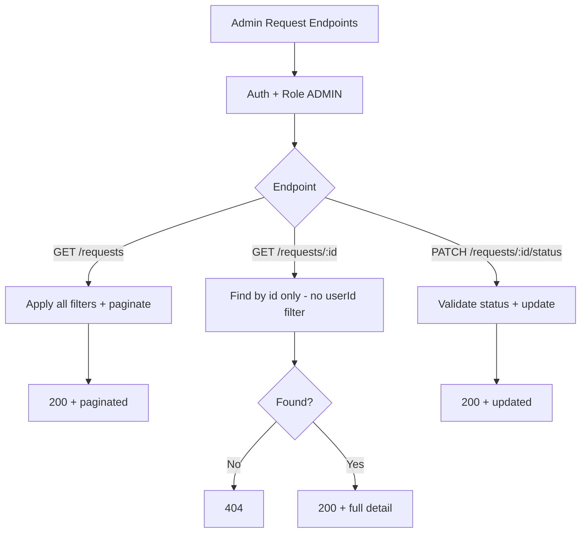
```mermaid
flowchart TD
    A[Admin Request Endpoints] --> B[Auth + Role ADMIN]
    B --> C{Endpoint}
    C -->|GET /requests| D[Apply all filters + paginate]
    C -->|GET /requests/:id| E[Find by id only - no userId filter]
    C -->|PATCH /requests/:id/status| F[Validate status + update]
    D --> G[200 + paginated]
    E --> H{Found?}
    H -->|No| I[404]
    H -->|Yes| J[200 + full detail]
    F --> K[200 + updated]
```

---

### GET /admin/statistics

Get system-wide statistics summary.

**Auth**: Bearer — role `ADMIN`

**Query Params**: None

**Response 200:**
```json
{
  "success": true,
  "data": {
    "users": {
      "total": 150,
      "byRole": { "USER": 130, "REVIEWER": 15, "ADMIN": 5 }
    },
    "requests": {
      "total": 320,
      "byStatus": {
        "PENDING": 80,
        "UNDER_REVIEW": 60,
        "NEEDS_INFO": 20,
        "APPROVED": 100,
        "REJECTED": 60
      }
    },
    "services": {
      "total": 5
    }
  }
}
```

**Flow:**

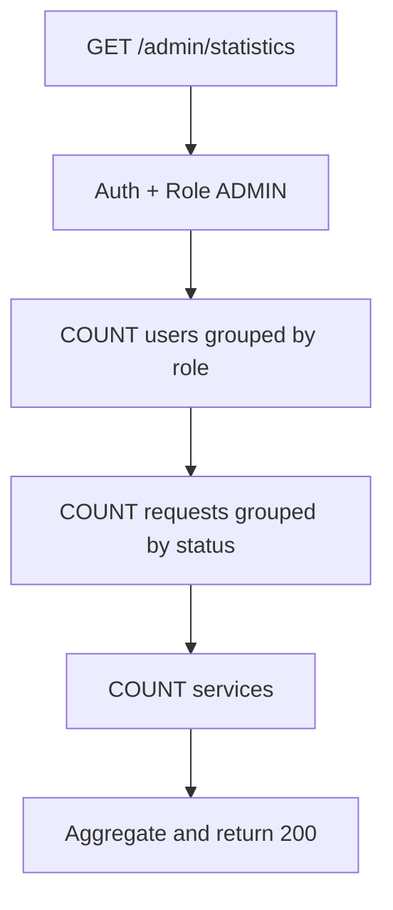
```mermaid
flowchart TD
    A[GET /admin/statistics] --> B[Auth + Role ADMIN]
    B --> C[COUNT users grouped by role]
    C --> D[COUNT requests grouped by status]
    D --> E[COUNT services]
    E --> F[Aggregate and return 200]
```

---

## Health Check

### GET /health

Simple liveness probe — no authentication required.

**Auth**: None (public)

**Response 200:**
```json
{
  "success": true,
  "message": "Server is running"
}
```

---

## Error Responses

All error responses follow this structure:

```json
{
  "success": false,
  "message": "Human-readable error description",
  "errors": ["field1: must be a string", "field2: is required"]
}
```

The `errors` array is only present for validation failures (400).

**Standard HTTP Status Codes:**

| Code | Meaning |
|---|---|
| 200 | Success |
| 201 | Created |
| 400 | Bad Request / Validation Error |
| 401 | Unauthorized (missing or invalid token) |
| 403 | Forbidden (insufficient role) |
| 404 | Resource Not Found |
| 409 | Conflict (duplicate / state violation) |
| 422 | Unprocessable Entity |
| 500 | Internal Server Error |

**Auth Middleware Flow:**

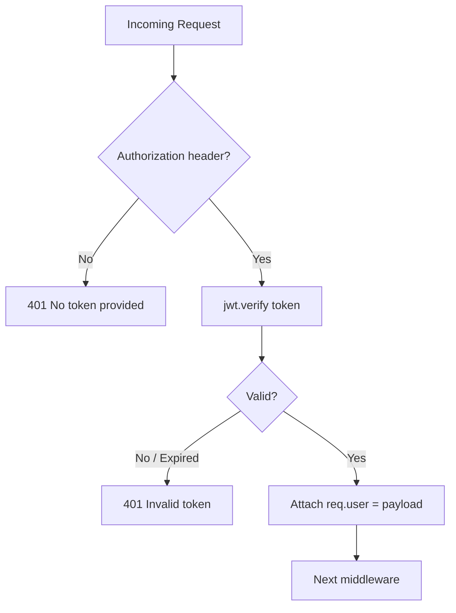
```mermaid
flowchart TD
    R[Incoming Request] --> A{Authorization header?}
    A -->|No| B[401 No token provided]
    A -->|Yes| C[jwt.verify token]
    C --> D{Valid?}
    D -->|No / Expired| E[401 Invalid token]
    D -->|Yes| F[Attach req.user = payload]
    F --> G[Next middleware]
```

---

## Pagination

All list endpoints return a `meta` object:

```json
{
  "meta": {
    "page": 1,
    "limit": 10,
    "total": 47,
    "totalPages": 5
  }
}
```

**Query Parameters:**

| Param | Default | Description |
|---|---|---|
| `page` | `1` | 1-based page index |
| `limit` | `10` | Items per page |

**Skip calculation:** `skip = (page - 1) * limit`
