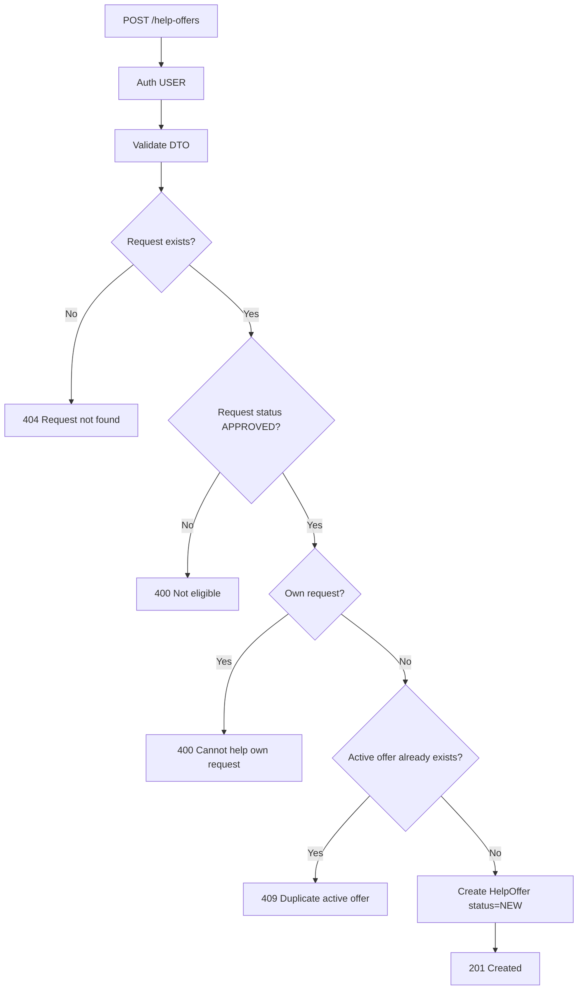
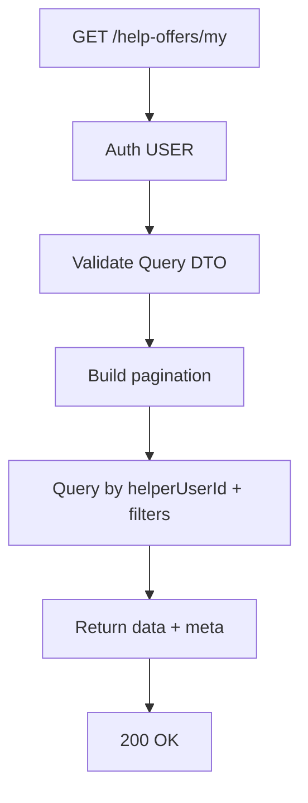
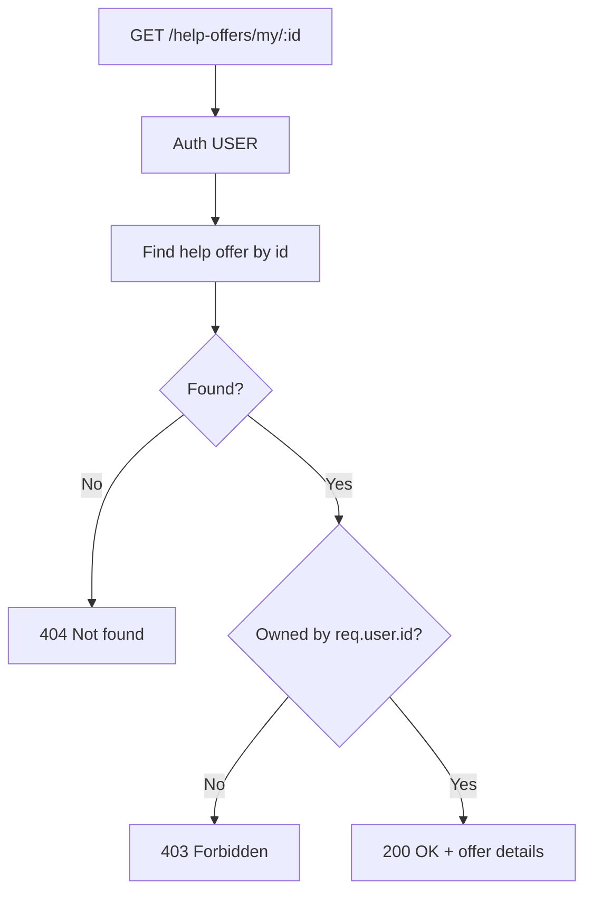
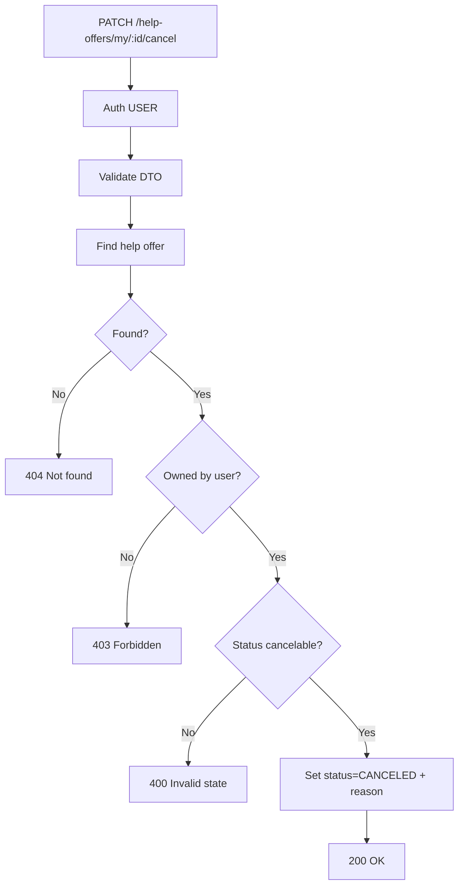
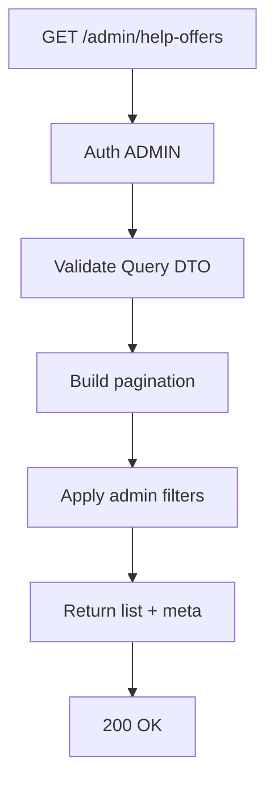
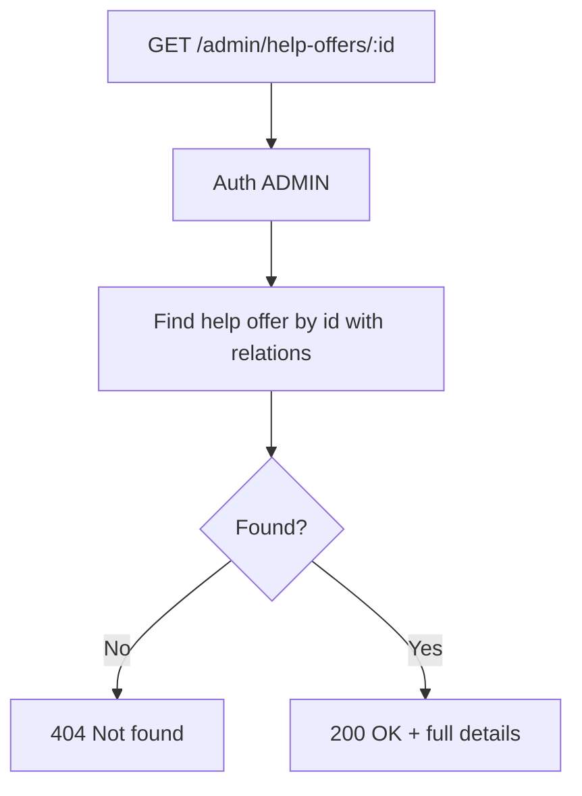
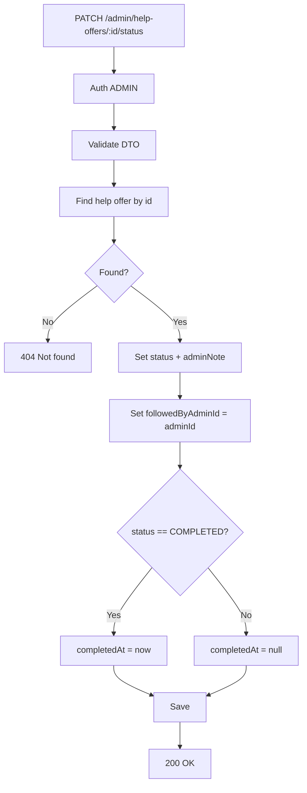
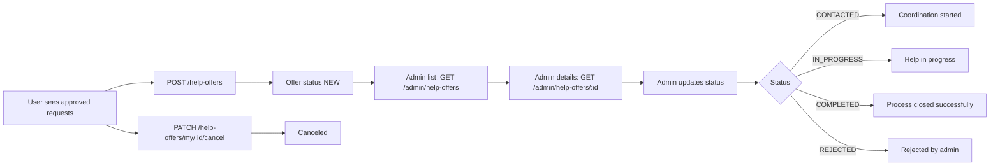

# دليل شامل: واجهات Help Offers المضافة حديثًا

هذا المستند يوثق كل ما تم إضافته في مرحلة Help Offers فقط، بدون تغيير أي API قديم.

## 1) ماذا تمت إضافته

تمت إضافة موديول جديد مستقل اسمه Help Offers يحقق السيناريو التالي:

- المستخدم يرى الطلبات العامة المعتمدة (موجودة مسبقًا).
- المستخدم يختار طلبًا ويقدم عرض مساعدة عليه.
- النظام يخزن العلاقة: من قدّم المساعدة + لأي طلب.
- الأدمن يتابع حالة العرض ويحدّثها حتى الإغلاق.

## 2) بنية الارتباط داخل النظام

### 2.1 الكيان الجديد

- جدول جديد: help_offers
- الكيان: src/entities/HelpOffer.ts

العلاقات:

- help_offers.requestId -> requests.id
- help_offers.helperUserId -> users.id
- help_offers.followedByAdminId -> users.id (اختياري)

### 2.2 الحقول الأساسية

- id
- requestId
- helperUserId
- followedByAdminId (nullable)
- message (nullable)
- adminNote (nullable)
- cancelReason (nullable)
- completedAt (nullable)
- status
- createdAt
- updatedAt

### 2.3 حالات العرض (HelpOfferStatus)

- NEW
- CONTACTED
- IN_PROGRESS
- COMPLETED
- REJECTED
- CANCELED

## 3) الملفات التي تم إضافتها/تعديلها

### 3.1 ملفات جديدة

- src/entities/HelpOffer.ts
- src/dtos/help-offer.dto.ts
- src/repositories/help-offer.repository.ts
- src/services/help-offer.service.ts
- src/controllers/help-offer.controller.ts
- src/controllers/admin-help-offer.controller.ts
- src/routes/help-offer.routes.ts
- src/routes/admin-help-offer.routes.ts

### 3.2 ملفات تم تعديلها للربط

- src/constants/enums.ts
- src/config/data-source.ts
- src/routes/index.ts
- api-tests.http
- API.md

## 4) المسارات الجديدة كاملة (بدون استثناء)

Base URL:

- http://localhost:5000/api/v1

### 4.1 User APIs

1. POST /help-offers
2. GET /help-offers/my
3. GET /help-offers/my/:id
4. PATCH /help-offers/my/:id/cancel

### 4.2 Admin APIs

1. GET /admin/help-offers
2. GET /admin/help-offers/:id
3. PATCH /admin/help-offers/:id/status

## 5) قواعد العمل (Business Rules)

1. لا يمكن تقديم مساعدة على طلب غير معتمد.

- يجب أن تكون حالة الطلب الهدف APPROVED.

2. لا يمكن للمستخدم تقديم مساعدة على طلبه الشخصي.

- إذا request.userId = helperUserId يتم الرفض.

3. منع تكرار العرض النشط لنفس المستخدم على نفس الطلب.

- الحالات النشطة: NEW, CONTACTED, IN_PROGRESS.
- إذا يوجد عرض نشط مسبقًا لنفس (helperUserId + requestId) يتم الرفض 409.

4. إلغاء العرض من المستخدم له قيود.

- لا يمكن إلغاء عرض بحالة COMPLETED أو REJECTED.
- لا يمكن إلغاء عرض تم إلغاؤه سابقًا.

5. الأدمن عند تحديث الحالة:

- يتم تسجيل followedByAdminId = adminId.
- عند التحويل إلى COMPLETED يتم تعيين completedAt تلقائيًا.

## 6) كيفية الاستدعاء (Calling) + الاستخدام (Usage)

ملاحظة: كل الأمثلة التالية موجودة أيضًا في api-tests.http.

### 6.1 POST /help-offers

الغرض:

- إنشاء عرض مساعدة جديد من مستخدم على طلب معتمد.

الصلاحية:

- USER فقط.

Headers:

- Authorization: Bearer USER_TOKEN
- Content-Type: application/json

Body:

```json
{
  "requestId": 15,
  "message": "I can provide support this week"
}
```

نجاح متوقع:

- 201 Created

أخطاء شائعة:

- 400 إذا الطلب غير APPROVED أو محاولة مساعدة طلبك الشخصي.
- 404 إذا الطلب غير موجود.
- 409 إذا يوجد عرض نشط سابق لنفس الطلب.

Flowchart:



---

### 6.2 GET /help-offers/my

الغرض:

- جلب كل عروض المساعدة الخاصة بالمستخدم الحالي مع Pagination/Filtering.

الصلاحية:

- USER فقط.

Headers:

- Authorization: Bearer USER_TOKEN

Query Parameters:

- page
- limit
- status
- requestId
- search

مثال:

- GET /help-offers/my?page=1&limit=10&status=NEW

نجاح متوقع:

- 200 OK

Flowchart:



---

### 6.3 GET /help-offers/my/:id

الغرض:

- جلب تفاصيل عرض واحد يخص المستخدم الحالي فقط.

الصلاحية:

- USER فقط.

Headers:

- Authorization: Bearer USER_TOKEN

Path Param:

- id = helpOfferId

نجاح متوقع:

- 200 OK

أخطاء شائعة:

- 404 إذا العرض غير موجود.
- 403 إذا العرض لا يخص المستخدم.

Flowchart:



---

### 6.4 PATCH /help-offers/my/:id/cancel

الغرض:

- إلغاء عرض مساعدة للمستخدم الحالي.

الصلاحية:

- USER فقط.

Headers:

- Authorization: Bearer USER_TOKEN
- Content-Type: application/json

Body:

```json
{
  "cancelReason": "Unable to continue"
}
```

نجاح متوقع:

- 200 OK

أخطاء شائعة:

- 404 إذا العرض غير موجود.
- 403 إذا العرض لا يخص المستخدم.
- 400 إذا الحالة CANCELED مسبقًا أو COMPLETED أو REJECTED.

Flowchart:



---

### 6.5 GET /admin/help-offers

الغرض:

- قائمة عروض المساعدة للأدمن مع الفلترة والمتابعة.

الصلاحية:

- ADMIN فقط.

Headers:

- Authorization: Bearer ADMIN_TOKEN

Query Parameters:

- page
- limit
- status
- requestId
- helperUserId
- city
- search

مثال:

- GET /admin/help-offers?page=1&limit=20&status=NEW

نجاح متوقع:

- 200 OK

Flowchart:



---

### 6.6 GET /admin/help-offers/:id

الغرض:

- جلب تفاصيل عرض مساعدة واحد بشكل كامل للأدمن.

الصلاحية:

- ADMIN فقط.

Headers:

- Authorization: Bearer ADMIN_TOKEN

Path Param:

- id = helpOfferId

نجاح متوقع:

- 200 OK

أخطاء شائعة:

- 404 إذا العرض غير موجود.

Flowchart:



---

### 6.7 PATCH /admin/help-offers/:id/status

الغرض:

- تحديث حالة عرض المساعدة من قبل الأدمن وتسجيل ملاحظة متابعة.

الصلاحية:

- ADMIN فقط.

Headers:

- Authorization: Bearer ADMIN_TOKEN
- Content-Type: application/json

Body:

```json
{
  "status": "IN_PROGRESS",
  "adminNote": "Coordinator contacted both parties"
}
```

نجاح متوقع:

- 200 OK

أخطاء شائعة:

- 404 إذا العرض غير موجود.
- 400 إذا status غير صالح حسب enum.

Flowchart:



## 7) الربط مع واجهاتك الحالية في الفرونت

التكامل المقترح خطوة بخطوة:

1. الشاشة الحالية للطلبات العامة تبقى كما هي (GET /requests/public).
2. عند ضغط زر تقديم مساعدة على بطاقة طلب:
   - استدعاء POST /help-offers مع requestId.
3. شاشة المتطوع/المساعد:
   - عرض طلباته عبر GET /help-offers/my.
   - إلغاء عرض عند الحاجة عبر PATCH /help-offers/my/:id/cancel.
4. لوحة الأدمن:
   - Inbox عروض جديدة عبر GET /admin/help-offers?status=NEW.
   - التفاصيل عبر GET /admin/help-offers/:id.
   - متابعة الحالة عبر PATCH /admin/help-offers/:id/status.

## 8) مخطط تدفقي شامل End-to-End



## 9) أمثلة سريعة جاهزة (REST Client)

راجع الأمثلة الجاهزة في:

- api-tests.http

أقسام:

- HELP OFFERS - USER APIS
- HELP OFFERS - ADMIN APIS

## 10) التوافق مع النظام السابق

- لم يتم تعديل أي endpoint قديم.
- جميع الإضافات تمت تحت مسارات جديدة مستقلة.
- الربط مع قاعدة البيانات تم عبر Entity جديد فقط.

## 11) ملاحظات تشغيل

- لأن المشروع يعمل بـ synchronize، سيتم إنشاء جدول help_offers تلقائيًا عند تشغيل السيرفر إذا DB_SYNCHRONIZE=true.
- تأكد أن المستخدمين المستعملين في الاختبار عندهم أدوار صحيحة (USER / ADMIN).
