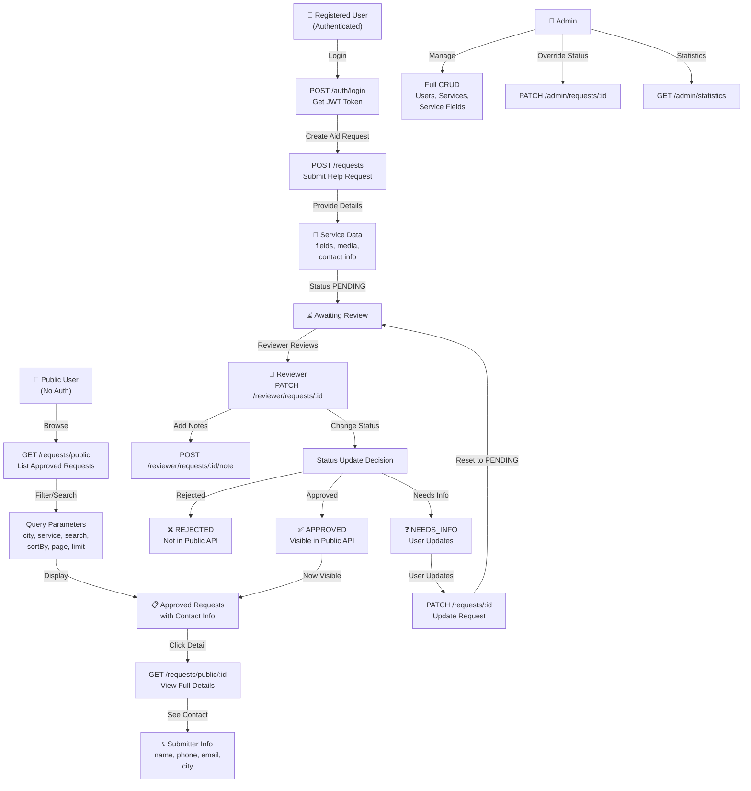
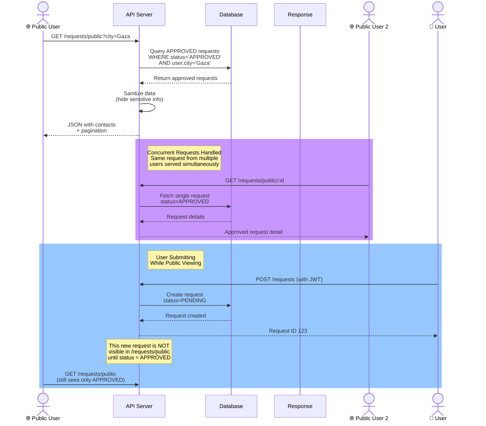
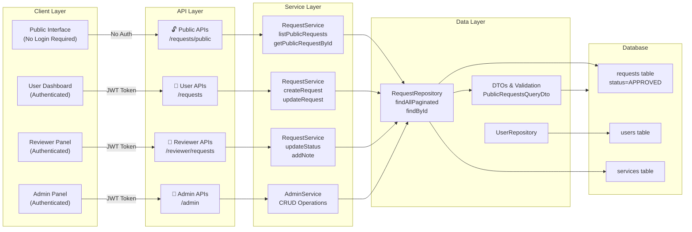

# Citizen Assistance Platform - Backend Documentation

## 1. System Overview

This project is a production-grade RESTful API for a citizen assistance platform where citizens submit aid or reconstruction requests and authorized reviewers process them.

The platform supports:
- user registration and login
- dynamic service-based request forms
- request lifecycle tracking
- reviewer moderation with notes and status transitions
- admin-level system management and analytics

Technology stack:
- Node.js
- Express.js
- TypeScript
- TypeORM
- MySQL2
- class-validator
- JWT authentication

The project uses TypeORM synchronize in development and does not use migrations (as requested).

## 2. Architecture Explanation

The project follows a layered architecture:

- `controllers`: receive HTTP requests and return HTTP responses.
- `services`: implement business logic and workflow rules.
- `repositories`: encapsulate data access with TypeORM.
- `entities`: relational database schema and relations.
- `middlewares`: auth, role checks, DTO validation, and global error handling.
- `dtos`: request validation models using class-validator.
- `utils`: shared helpers (JWT, pagination, errors, password hashing).

Why this architecture is scalable:
- low coupling between transport and business logic
- clear domain boundaries
- repositories can be mocked in tests
- endpoints remain thin and maintainable

## 3. Role-Based Workflow

### PUBLIC (No Authentication)
- browses approved help requests
- searches requests by city, service type, keywords
- views contact information of request submitters
- filters and paginates results
- no authentication or token required

### USER
- registers and logs in
- lists available services
- creates multiple requests (aid submissions, donations, volunteering)
- tracks request status
- views reviewer notes
- updates own request only when status is `PENDING` or `NEEDS_INFO`
- submits media (proof of need, documents)

### REVIEWER
- views assigned requests or all requests
- filters and searches requests
- adds notes visible to user
- updates request status to: `PENDING`, `UNDER_REVIEW`, `NEEDS_INFO`, `APPROVED`, `REJECTED`
- must provide rejection reason for `REJECTED`
- approves requests to make them visible in public list

### ADMIN
- full CRUD on users, services, service fields
- reads and overrides request statuses
- system analytics
- role management through user CRUD/update

## 4. Request Lifecycle

Workflow:

`USER -> CREATE REQUEST -> REVIEWER -> REVIEW -> (APPROVED | REJECTED | NEEDS_INFO)`
                                                         ↓
                                            `PUBLIC API -> VIEW APPROVED`

Detailed steps:
1. User selects service and submits dynamic field data.
2. Request is created with status `PENDING`.
3. Reviewer opens request and can add notes.
4. Reviewer changes status to `UNDER_REVIEW`, `NEEDS_INFO`, `APPROVED`, or `REJECTED`.
5. If `NEEDS_INFO`, user updates request and it returns to `PENDING`.
6. If `APPROVED`, request becomes visible in public API with contact information.
7. Public can browse and search approved requests without authentication.
8. Final states are `APPROVED` or `REJECTED`.

## 5. State Diagram (Text-Based)

```text
[CREATE] -> PENDING
PENDING -> UNDER_REVIEW
PENDING -> NEEDS_INFO
PENDING -> APPROVED
PENDING -> REJECTED
UNDER_REVIEW -> NEEDS_INFO
UNDER_REVIEW -> APPROVED
UNDER_REVIEW -> REJECTED
NEEDS_INFO -> PENDING   (after user update)
APPROVED -> [FINAL] -> [VISIBLE IN PUBLIC API]
REJECTED -> [FINAL]
```

Rule:
- `REJECTED` requires `rejectionReason`.
- Only `APPROVED` requests are visible in public API.

## 5.1 Complete System Flow Diagram (Mermaid)



## 5.2 Synchronization & Concurrency Flow



## 5.3 Data Flow Architecture



## 5.4 Public API Request Processing Flow

```mermaid
flowchart TD
    A["🌐 Public User<br/>No Authentication<br/>No JWT Token"] -->|GET /requests/public| B["PublicAPI Layer"]
    B -->|No Auth Check| C["Accept Request"]
    C -->|Query Builder| D["RequestRepository<br/>findAllPaginated"]
    D -->|WHERE status='APPROVED'| E["Database Query"]
    E -->|Return Approved Rows| F["Sanitize Data<br/>Hide sensitive fields"]
    F -->|Map to DTOs| G["PublicRequestResponse<br/>with Contact Info"]
    G -->|Pagination Meta| H["Return 200 OK<br/>+ data array<br/>+ page, limit, total"]
    H -->|JSON Response| A
    
    rect rgb(200, 255, 200)
    note right of F: Data Exposed:<br/>- name, phone, email<br/>- city, service details<br/>- request data, media
    end
    
    rect rgb(255, 200, 200)
    note right of F: Data Hidden:<br/>- passwords<br/>- rejection reasons<br/>- internal notes
    end
```

## 5.5 Concurrent Request Handling

```mermaid
graph LR
    subgraph Users["Multiple Users (Concurrent)"]
        U1["👤 User A<br/>Creating Request"]
        U2["🌐 Public User B<br/>Browsing Requests"]
        U3["👮 Reviewer C<br/>Approving Request"]
    end
    
    subgraph Processing["Request Processing"]
        P1["POST /requests<br/>User A"]
        P2["GET /requests/public<br/>Public B"]
        P3["PATCH /reviewer/requests/:id<br/>Reviewer C"]
    end
    
    subgraph Database["Database Layer<br/>Connection Pool"]
        W1["Write Transaction<br/>INSERT request"]
        R1["Read Query<br/>SELECT APPROVED"]
        W2["Update Transaction<br/>UPDATE status"]
    end
    
    U1 -->|Async| P1
    U2 -->|Async| P2
    U3 -->|Async| P3
    
    P1 -->|Queue| W1
    P2 -->|Query| R1
    P3 -->|Queue| W2
    
    W1 -->|Serializable| DB[(Database)]
    R1 -->|Read-Only<br/>Consistent| DB
    W2 -->|Serializable| DB
    
    note over Processing: Node.js Event Loop<br/>Handles multiple<br/>requests simultaneously
    note over Database: MySQL Connection Pool<br/>Manages concurrent<br/>transactions safely

## 6. Sequence Flow (Step-by-Step)

### Public Browsing Flow (NEW - No Authentication)
1. Public user visits the platform without logging in.
2. Public user can browse approved requests via `/requests/public`.
3. Public user can filter by city, service type, keywords, or sort by date.
4. Public user can view detailed contact information of request submitters.
5. Public user can see media attachments and request details.
6. Contact with submitter is done directly via provided phone/email.

### User Submission Flow
1. User authenticates with JWT.
2. User fetches `/services`.
3. User submits `/requests` with `serviceId` and dynamic `data[]`.
4. API validates service fields and required fields.
5. Request + request_data are persisted.

### Reviewer Processing Flow
1. Reviewer fetches `/reviewer/requests`.
2. Reviewer opens a request and posts note via `/reviewer/requests/:id/note`.
3. Reviewer updates status via `/reviewer/requests/:id/status`.
4. API enforces business rules (e.g., rejection reason required).

### Needs Info Flow
1. Reviewer sets request status to `NEEDS_INFO`.
2. User updates request via `/requests/:id`.
3. API resets status to `PENDING` for re-review.

## 7. API Documentation

Base URL: `/api/v1`

### Health
- `GET /health`
- Response: `200`

### Auth
- `POST /auth/register`
- `POST /auth/login`

Register example:
```json
{
  "name": "Ahmad User",
  "email": "ahmad@example.com",
  "password": "StrongPass123",
  "phone": "+970599000000",
  "city": "Gaza"
}
```

Login example:
```json
{
  "email": "ahmad@example.com",
  "password": "StrongPass123"
}
```

### User Endpoints
- `GET /services`
- `POST /requests`
- `GET /requests/my`
- `GET /requests/:id`
- `PATCH /requests/:id`
- `DELETE /requests/:id`

Create request example:
```json
{
  "serviceId": 1,
  "data": [
    { "fieldId": 1, "value": "Gaza - Al Remal" },
    { "fieldId": 2, "value": "Severe" }
  ],
  "media": [
    { "filePath": "uploads/report.pdf", "type": "pdf" }
  ]
}
```

### Reviewer Endpoints
- `GET /reviewer/requests`
- `PATCH /reviewer/requests/:id/status`
- `POST /reviewer/requests/:id/note`

Status update example:
```json
{
  "status": "REJECTED",
  "rejectionReason": "Missing required ownership document"
}
```

Add note example:
```json
{
  "note": "Please upload a clearer national ID image"
}
```

### Admin Endpoints
- `GET /admin/users`
- `POST /admin/users`
- `PATCH /admin/users/:id`
- `DELETE /admin/users/:id`
- `GET /admin/services`
- `POST /admin/services`
- `PATCH /admin/services/:id`
- `DELETE /admin/services/:id`
- `GET /admin/service-fields`
- `POST /admin/service-fields`
- `PATCH /admin/service-fields/:id`
- `DELETE /admin/service-fields/:id`
- `GET /admin/requests`
- `PATCH /admin/requests/:id/status`
- `GET /admin/statistics`

Common status codes:
- `200 OK`
- `201 Created`
- `400 Bad Request`
- `401 Unauthorized`
- `403 Forbidden`
- `404 Not Found`
- `409 Conflict`
- `500 Internal Server Error`

## 8. Database Schema Explanation

### users
- `id`, `name`, `email`, `password`, `phone`, `role`, `city`, `createdAt`

### services
- `id`, `name`, `description`, `createdAt`

### service_fields
- `id`, `serviceId`, `fieldName`, `fieldType`, `required`

### requests
- `id`, `userId`, `serviceId`, `assignedReviewerId`, `status`, `rejectionReason`, `createdAt`, `updatedAt`

### request_data
- `id`, `requestId`, `fieldId`, `value`

### request_notes
- `id`, `requestId`, `reviewerId`, `note`, `createdAt`

### media
- `id`, `requestId`, `filePath`, `type`, `uploadedAt`

Relationship summary:
- one user -> many requests
- one service -> many requests
- one service -> many service fields
- one request -> many request_data
- one request -> many notes
- one request -> many media files

## 9. Business Rules

1. Registration creates `USER` role only.
2. JWT required for protected endpoints.
3. Role middleware enforces USER / REVIEWER / ADMIN permissions.
4. Request creation must satisfy selected service required fields.
5. User can update request only in `PENDING` or `NEEDS_INFO`.
6. Reviewer rejection requires `rejectionReason`.
7. Admin can override request status.
8. Pagination is supported on list endpoints.
9. Filters supported: status, serviceId, city, search.
10. Global error handler standardizes error responses.
11. **Public API**: Only `APPROVED` requests are visible to unauthenticated users.
12. **Public API**: Contact information (phone, email, name, city) is exposed for approved requests.
13. **Public API**: No authentication required; available to anyone on the internet.
14. **Public API**: Filtering by city, service type, and search are supported.

## 10. Public API Features & Privacy

### Public Access to Approved Requests

The system includes a public-facing API that allows anyone (without authentication) to browse help requests that have been **approved by reviewers**.

**Data Exposed in Public API:**
- Request ID
- Request Status (only APPROVED)
- Creation and update timestamps
- Service name and description
- Submitter's full name
- Submitter's phone number
- Submitter's email address
- Submitter's city
- Request details (description, amount, etc.)
- Media attachments (images, PDFs)

**Data NOT Exposed:**
- Password hashes
- Rejection reasons (if request was rejected)
- Internal reviewer notes (pending requests)
- Assigning reviewer identity

**Public Endpoints:**
- `GET /requests/public` - List all approved requests with filtering
- `GET /requests/public/:id` - View details of specific approved request

**Use Cases:**
1. Donors can discover help requests in their area
2. Volunteers can find opportunities to help
3. Organizations can find people needing assistance
4. Community awareness of ongoing needs
5. Direct contact with request submitters

**Privacy Controls:**
- User can opt-out by not approving requests (leave in PENDING/NEEDS_INFO)
- Admin can reject requests if sensitive information is detected
- Contact information is shown only for approved requests
- Submitter information is complete for transparency with donors

## Appendix - Development Notes

- TypeORM synchronize should be used only in development.
- For production, disable synchronize and manage schema externally.
- Initial service and field data are auto-seeded when `SEED_ON_START=true`.
- Public APIs are rate-limited at server level (if configured).
- Public APIs use standard pagination: page and limit query parameters.
